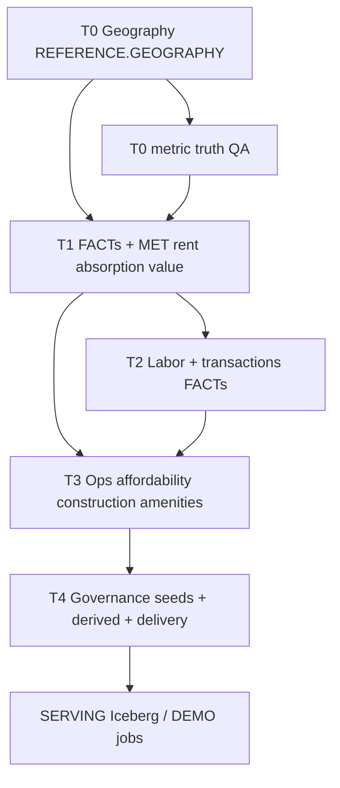

# Migration plan — SERVING.DEMO gaps (geography → catalog → delivery)

**Owner:** Alex  
**Canonical repo:** pretiumdata-dbt-semantic-layer (this document).  
**Inputs:** User tier list (T0–T4) aligned to [SERVING_DEMO_METRICS_CATALOG_MAP.md](../reference/SERVING_DEMO_METRICS_CATALOG_MAP.md), [QA_METRIC_LAYER_VALIDATION.md](./QA_METRIC_LAYER_VALIDATION.md) §0–§0.2, [SERVING_DEMO_ICEBERG_TARGETS.md](../reference/SERVING_DEMO_ICEBERG_TARGETS.md).

**pretium-ai-dbt mirror (tier tables only):** [SERVING_DEMO_GAP_TIERS_MIRRORED.md](../../../../pretium-ai-dbt/docs/migration/SERVING_DEMO_GAP_TIERS_MIRRORED.md) — same gap narrative for engineers in the legacy repo; edit milestones here only.

**Principle:** No **MET_*** or **`metric_derived`** row ships with a **`table_path`** that does not resolve in Snowflake (see [METRIC_INTAKE_CHECKLIST.md](./METRIC_INTAKE_CHECKLIST.md) and QA §1e/§1f language in the map). Geography and FACT parents land **before** catalog expansion where the graph requires joins.

---

## 0. Dependency spine (what blocks what)

---

## Tier 0 — Spine (sequenced first)

| Work package | Deliverable | Exit criteria | Primary refs |
|--------------|-------------|---------------|----------------|
| **T0.G1 — Polyfills & H3 bridges** | Snowflake objects queryable for corridor stack | `SELECT COUNT(*)` > 0 (or agreed min coverage) on **ZIP↔H3 R8**, **BG↔H3 R8**, **CBSA↔H3 R8**; compat views match [QA_METRIC_LAYER_VALIDATION.md](./QA_METRIC_LAYER_VALIDATION.md) §0.1 | [RUN_CORRIDOR_H3_TRANSFORM_DEV_OBJECTS.md](./RUN_CORRIDOR_H3_TRANSFORM_DEV_OBJECTS.md), `scripts/sql/migration/inventory_corridor_pipeline_critical.sql`, pretium-ai-dbt `scripts/sql/reference/geography/` |
| **T0.G2 — Admin xwalks** | `zip_county_xwalk`, `county_cbsa_xwalk`, `zcta_cbsa_xwalk`, etc. | dbt `source('reference_geography', …)` models compile; QA GOV_REFERENCE coverage where required | [QA_METRIC_LAYER_VALIDATION.md](./QA_METRIC_LAYER_VALIDATION.md) §0.2 |
| **T0.G3 — Place / corridor (optional)** | **`BRIDGE_PLACE_H3_R8_POLYFILL`**, **`BRIDGE_PLACE_ZIP`** | Documented operator path; `source()` added in repo **or** explicit exclusion with Presley sign-off | [MIGRATION_TASKS_CORRIDOR_PIPELINE_SOURCES.md](./MIGRATION_TASKS_CORRIDOR_PIPELINE_SOURCES.md) §1.3 |
| **T0.C1 — Catalog truth** | Re-run QA on **`metric.csv`** rows | `qa_status`/lineage checks pass for §1e/§1f; no `table_path` to missing objects | [QA_TRANSFORM_DEV_CATALOG_REGISTRATIONS.md](./QA_TRANSFORM_DEV_CATALOG_REGISTRATIONS.md) |
| **T0.D1 — SERVING physical** | Iceberg (or agreed) replication pattern for **SERVING.DEMO** | Job spec + target paths in [SERVING_DEMO_ICEBERG_TARGETS.md](../reference/SERVING_DEMO_ICEBERG_TARGETS.md) closed or explicitly deferred with ticket | Same doc “Gaps” |

**Milestone M0:** G1–G2 green; G3 scoped; C1 clean on in-scope **MET_***; D1 decision recorded.

---

## Tier 1 — `rent` / `absorption` / `value_avm` (catalog `concept_code` work)

| Work package | Missing today (summary) | Sequence | Exit criteria |
|--------------|-------------------------|----------|---------------|
| **T1.R1 — Rent FACTs + MET** | `rent_psf_median`, governed **effective_rent_index**, **concession_weeks_free** | After T0 joins; CoStar / Markerr / Yardi Matrix **FACT_** read-throughs + column inventory | **MET_*** rows + `bridge_product_type_metric`; Zillow long-form **MET_041** aggregation policy documented |
| **T1.R2 — Rent derived** | YoY / 3y–5y CAGR, **rent_to_income_ratio** | After T1.R1 + income inputs (Tier 2 partial) | **`metric_derived`** + **`metric_derived_input`** rows; no orphan inputs |
| **T1.A1 — Absorption / tightness** | `absorption_pace`, `net_absorption`, **uc_units**, `pipeline_burndown_ratio`, **inventory_months_supply** | **FACT** promotion order: inventory MOS → pipeline → net absorption as vendor truth allows | **CON_010** / **CON_011** metrics registered or explicitly `metric_derived` with documented proxies |
| **T1.A2 — Vacancy / HUD** | **MET_008 / MET_013** VARIABLE choice | Governance note + seed filter doc | Consistent vacancy series per product |
| **T1.A3 — Listings concept fit** | **MET_043** aligned to **`absorption`** (listings velocity / liquidity proxy) | Keep **`MET_042`** DOM/price-cuts + **MDV_004** spine as the paired read surface | Single agreed `concept_code` per slug in map |
| **T1.V1 — AVM / collateral** | Cherre (or agreed) AVM **FACT** beyond FHFA/UAD | Cherre WL + AVM inventory | Extra **`metric`** rows with real `snowflake_column` |
| **T1.V2 — Derived HPA / LTV stress** | `hpa_trailing`, `hpa_cumulative`, **ltv_stress_proxy** | **metric_derived** where FACTs insufficient | Inputs listed; MDV rows versioned |

**Milestone M1:** §1 / §4 / §7 of [SERVING_DEMO_METRICS_CATALOG_MAP.md](../reference/SERVING_DEMO_METRICS_CATALOG_MAP.md) updated with **Registered** or **Derived (MDV_*)** for agreed DEMO slugs.

---

## Tier 2 — DEMO bundles (`labor_growth_access`, `transactions_sale_volume`)

| Work package | Missing today | Dependency | Exit criteria |
|--------------|---------------|--------------|---------------|
| **T2.L1 — Income & HH structure MET_*** | `median_hh_income`, **income_growth_yoy**, **employment_density**, **renter_share**, **population_growth**, **hh_growth** | ACS / Cybersyn **FACT** paths (see [VENDOR_CONCEPT_COVERAGE_MATRIX.md](./VENDOR_CONCEPT_COVERAGE_MATRIX.md) §3.A) | **MET_*** or documented **metric_derived** from seeded ACS facts |
| **T2.L2 — Bundle-only slugs** | `age_cohort_dependency`, **affordability_ratio**, **workforce_renter_share** | T2.L1 + population concepts | Register or mark **out of scope** in map |
| **T2.T1 — Transactions** | **`transaction_volume`**; no **`transactions`** `concept_code` | Cherre recorder / MLS **FACT** promotion + governance | New **`concept`** row if product adopts; **MET_*** tied to FACT |

**Milestone M2:** Map §2 / §6 rows flip from **Gap** to **Registered** or **Deferred** with ticket id.

---

## Tier 3 — Ops / HH demand / affordability / construction / amenities

| Work package | Missing today | Notes | Exit criteria |
|--------------|---------------|-------|----------------|
| **T3.O1** | **opex_escalation_proxy** | May be **metric_derived** or external index | MDV or **MET_*** |
| **T3.A1** | **RTI / affordability** composite (**WL_045**) | Depends on stable RTI FACT or inputs | **metric_derived** wired |
| **T3.C1** | **uc_units**, **permit_to_stock_ratio**, **regulatory_supply_index**, **construction_cost_index** | **MET_001** only for permits today | FACT + MET or defer |
| **T3.L1** | **location_amenity_index** | Crime/school concepts exist; unified index absent | Single MET or MDV definition |

**Milestone M3:** Map §5 / §8 / §9 / §10 gaps each have **owner**, **artifact type** (FACT vs MET vs MDV), and **target quarter** (or **deferred**).

---

## Tier 4 — Governance artifacts (parallel, not blocked on all FACTs)

| Work package | Deliverable | Exit criteria |
|--------------|-------------|---------------|
| **T4.X1 — Bundle crosswalk seed** | CSV (+ optional YAML) mapping DEMO bundle names → `concept_code` / `metric_id` | dbt tests: FK to `concept`, optional `metric`; doc in `docs/reference/` |
| **T4.X2 — `metric_derived` expansion** | §12 engineered scores + §13 **corridor_model** columns | [CATALOG_METRIC_DERIVED_LAYOUT.md](../reference/CATALOG_METRIC_DERIVED_LAYOUT.md) updated; MDV rows + inputs |
| **T4.X3 — Ontology** | **`registry/ontology/CANONICAL_CONCEPT_ONTOLOGY.yml`** (if Presley contract) | In-tree copy **or** documented canonical URL + diff vs `concept.csv`; owner recorded in registry doc |
| **T4.X4 — SERVING jobs** | Repeatable load from agreed warehouse objects to Iceberg | Runbook merged with [SERVING_DEMO_ICEBERG_TARGETS.md](../reference/SERVING_DEMO_ICEBERG_TARGETS.md) |

**Milestone M4:** No “implicit” bundle language in SQL without a row in **T4.X1**.

---

## Execution checklist (operators)

1. Run **QA §0** Snowflake preflight matrix ([QA_METRIC_LAYER_VALIDATION.md](./QA_METRIC_LAYER_VALIDATION.md)).
2. Land **T0** geography + xwalk gaps (SnowSQL / DE tickets).
3. For each **Tier 1** theme: FACT inventory → `metric.csv` / `metric_derived` PRs in semantic-layer; sync pretium-ai-dbt catalog seeds if dual-published.
4. **Tier 2–3:** same pattern; never register **MET_*** before parent **FACT** exists unless marked **`under_review`** with explicit Snowflake exception (per intake checklist).
5. **Tier 4:** governance seeds and registry files in semantic-layer; Iceberg job spec co-owned with platform.
6. Update [SERVING_DEMO_METRICS_CATALOG_MAP.md](../reference/SERVING_DEMO_METRICS_CATALOG_MAP.md) changelog after each milestone.

---

## Optional deep dive

To produce a **checklist keyed only to §1–§7 `metric_id` slugs** from the map (e.g. Tier 1 only), narrow scope in a follow-on PR and link the slug table as an appendix here.

---

## Changelog

| Version | Notes |
|---------|--------|
| **0.1** | Initial plan: T0–T4 work packages, milestones M0–M4, dependency spine. |
