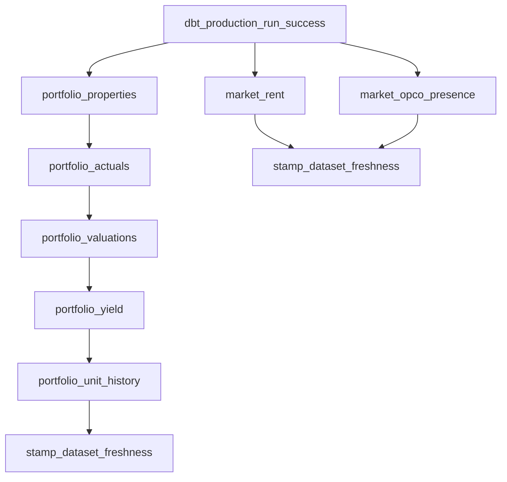
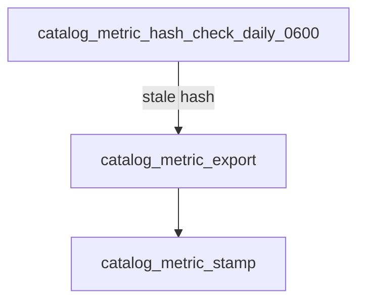
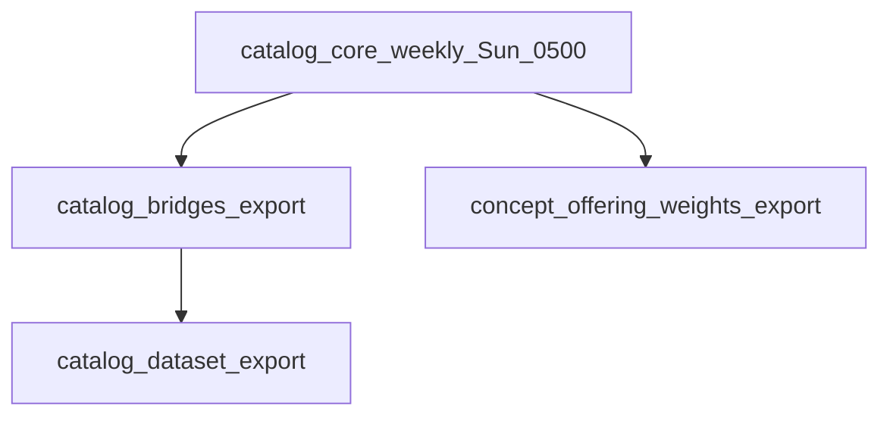
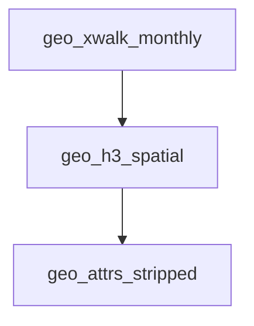

# Auto-refresh strategy by content type

**Purpose:** Target Snowflake **Task** trees, **gates** (hash / row count / human), and **orchestration hooks** so exports and catalog surfaces stay current without over-refreshing large or sensitive tables. This doc is the **design contract**; Task DDL may live in **`pretium-ai-dbt`** or platform repos until ported here.

**Related:** [`CATALOG_SEED_ORDER.md`](../CATALOG_SEED_ORDER.md) · [`SNOWFLAKE_ICEBERG_EXPORT_DUCKDB_BEST_PRACTICES.md`](./SNOWFLAKE_ICEBERG_EXPORT_DUCKDB_BEST_PRACTICES.md) · [`../../scripts/sql/reference/catalog/stamp_dataset_motherduck_after_iceberg_export.sql`](../../scripts/sql/reference/catalog/stamp_dataset_motherduck_after_iceberg_export.sql) · [`../../models/serving/iceberg/README.md`](../../models/serving/iceberg/README.md)

---

## 1. Catalog governance

| Sub-area | Trigger | Gate |
|----------|---------|------|
| **`catalog_metric`** (draft → export path; canonical **`REFERENCE.CATALOG.metric`** in prod) | Snowflake Task **daily 6:00** | **MD5 hash** of export payload (or seed build artifact); **skip** export + downstream if hash **unchanged** |
| **`catalog_core`**, **`catalog_bridges`**, **`catalog_dataset`** | Snowflake Task **weekly Sunday 05:00** | **Skip** if **row count** unchanged vs last run for each bundle member (cheap signal for bridge-heavy catalog slices) |

**Scope notes (this repo):**

- **Bridges** include `concept_*` / `dataset_*` bridge seeds and related catalog tables materialized from dbt.
- **`catalog_core`** aligns with the Iceberg contract stub **`models/serving/iceberg/catalog_core.sql`** (union of small catalog entities for lake export).

**Reconciliation:** If ops need a **daily** lightweight `catalog_core` export for dev/stage, run a separate low-cost task; the **weekly** gate above remains the default for prod catalog bulk.

---

## 2. Geography crosswalks

| Trigger | Gate |
|---------|------|
| **Manual** + **annual Census release** detection | **No hash gate** — tables are comparatively stable; **row count change** (or vintage metadata bump) is the primary signal |

**Monthly** task: compare **Census vintage year** (or official release flag) to **last export date**; enqueue crosswalk refresh when vintage advances.

---

## 3. Geography H3 spatial

| Trigger | Chain |
|---------|--------|
| Same task tree as **crosswalks** | **Monthly**, **`AFTER`** `geo_xwalk_refresh` completes |

H3 polyfill tables change **de facto** on Census boundary updates (annual). Keep chained so H3 never runs on stale crosswalk inputs.

---

## 4. Geography address

| Trigger | Gate |
|---------|------|
| **Vendor delivery notification** → **manual approval** → Task | **~158M rows** — **never** auto-refresh without human sign-off |

Task **exists in suspended** state; ops **resumes** only after confirming the new delivery and contract.

---

## 5. Portfolio facts

| Trigger | Chain |
|---------|--------|
| **Orchestration after successful dbt production run** (e.g. CI/CD or Airflow calling Snowflake) — *not* native dbt-in-Snowflake unless you wire an external signal | Linear dependency per table |

**Order:** `properties` → `actuals` → `valuations` → `yield` → `unit_history` → **`stamp_dataset_freshness`** (see §10).

**End state:** `REFERENCE.CATALOG.DATASET` rows for completed portfolio tables get **`IS_MOTHERDUCK_SERVED = TRUE`** and **`LAST_REFRESH_DATE = CURRENT_DATE()`** (same semantics as [`stamp_dataset_motherduck_after_iceberg_export.sql`](../../scripts/sql/reference/catalog/stamp_dataset_motherduck_after_iceberg_export.sql), extended with the portfolio **`dataset_code`** list).

---

## 6. Market signals

| Trigger | Chain |
|---------|--------|
| Same **post–dbt-prod** orchestration hook as portfolio (**separate branch**) | **`market_rent`** and **`market_opco_presence`** in **parallel** after the **portfolio** chain completes |

Vendor delivery lag may place these **1–2 days** after portfolio; do not block portfolio stamps on market branch.

---

## 7. Census / ACS

| Trigger | Gate |
|---------|------|
| **Annual** schedule (e.g. **December** window) | **Manual confirmation** of new ACS vintage before export |

**Row count validation:** a new vintage should **add** rows (or otherwise monotonic growth per policy) — **do not** silently accept a destructive replace without review.

---

## 8. Concept explanations (build)

**Table:** `REFERENCE.CATALOG.CONCEPT_EXPLANATION` (seed: `seeds/reference/catalog/concept_explanation.csv`).

| Trigger | Mechanism |
|---------|-----------|
| Any **`REFERENCE.CATALOG.CONCEPT`** insert or update | **Stream + Task** on concept changes |

```sql
create or replace stream reference.catalog.concept_stream on table reference.catalog.concept;
-- Root task: when stream has rows → rebuild / export concept_explanation slice → consume stream.
```

Downstream: refresh **`catalog_core`** slice for `entity = 'concept_explanation'` (or full `catalog_core` per weekly policy).

---

## 9. Offering × concept weights (build)

**Table:** `REFERENCE.CATALOG.CONCEPT_OFFERING_WEIGHT` (seed + matrix: `offering_concept_weight_matrix.yml`, sync script `scripts/reference/catalog/sync_concept_offering_weight_from_matrix.py`).

| Trigger | Chain |
|---------|--------|
| **Weekly** with **`catalog_core`** bundle | **`AFTER`** `catalog_core_weekly_export` (small table; **no hash gate**) |

---

## 10. Dataset freshness stamps (build)

| Trigger | Action |
|---------|--------|
| **End of every** portfolio **and** market task chain | `UPDATE` on `REFERENCE.CATALOG.DATASET` |

```sql
update reference.catalog.dataset
set
  is_motherduck_served = true,
  last_refresh_date = current_date()
where dataset_code in (/* completed tables for this chain */);
```

Maintain one **shared** `stamp_dataset_freshness` child task invoked from **both** branches so stamps stay idempotent and centralized.

---

## 11. Geography attrs (geometry-stripped) (build)

| Trigger | Chain |
|---------|--------|
| **`AFTER`** geography crosswalks, **monthly** | One export task **per geo level** (serialized or parallel per warehouse limits) |

Suggested order: **`geo_attrs_cbsa`** → **`geo_attrs_county`** → **`geo_attrs_tract`** → **`geo_attrs_zip`**.

---

## Task dependency trees

### A. dbt production run → portfolio + market → dataset stamps



*(Implement `stamp_dataset_freshness` once; both branches should call the same task or SQL procedure with disjoint `dataset_code` lists.)*

### B. Catalog metric (daily hash gate)



### C. Catalog core weekly + weights



*(Align schedule with §1; if you add a daily lightweight job, name it distinctly to avoid clashing with the weekly gate.)*

### D. Geography monthly chain



---

## Implementation checklist (Snowflake)

- [ ] Root tasks suspended by default for **§4 address** and any **§7** annual gate.
- [ ] **SYSTEM$STREAM_HAS_DATA** (or equivalent) for **`concept_stream`** before running concept explanation export.
- [ ] **TASK DEPENDENCY** `AFTER` chains match trees A–D.
- [ ] **`stamp_dataset_freshness`** parameterized by `dataset_code` list per chain (portfolio vs market).
- [ ] Document **who resumes** suspended tasks (ops roster) in the runbook that owns the warehouse account.
