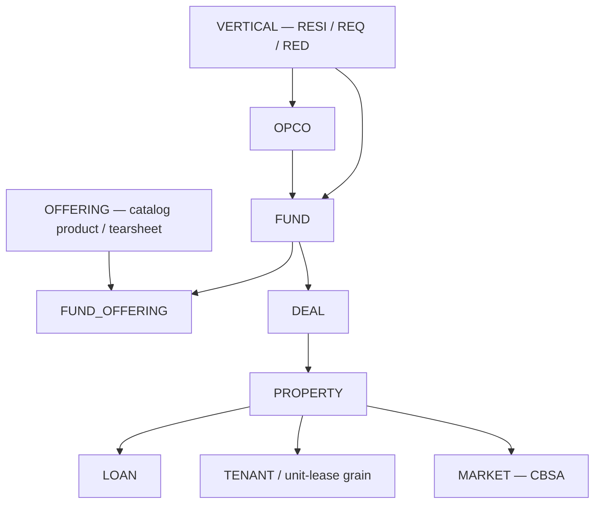

# Entity org hierarchy & FK contract (VERTICAL → … → PROPERTY)

**Owner:** Alex (with David / Spencer for `SOURCE_ENTITY` landings and OpCo paths)  
**Status:** canonical **organizational** join contract for fund modeling, acquisitions, portfolio, and exits.  
**Not in scope here:** **`REFERENCE.CATALOG`** market metrics (`CONCEPT_*`, `METRIC`) — join those on **`geo_id`** (e.g. CBSA) per [`CONCEPT_OBSERVATION_TALL_ROW_CONTRACT.md`](./CONCEPT_OBSERVATION_TALL_ROW_CONTRACT.md).

## Purpose

Lock a **single hierarchy** and **FK directions** so `dim_*` / `fact_*` / bridge tables in **`TRANSFORM.DEV`** (and CRM read-throughs) do not fork competing “roots” (e.g. **OFFERING** is not the org root; it binds to **funds** for product/analytics scope).

## Hierarchy (organizational)

**Reading:** **OFFERING** attaches to **FUND** only via **`FUND_OFFERING`** (many-to-many within vertical), not as a parent of **VERTICAL**.

## FK contract (logical entities)

| Entity / bridge | FK to | Notes |
|-----------------|-------|--------|
| **OPCO** | **VERTICAL** | One-to-many: an OpCo operates in **one** vertical in the registry. |
| **FUND** | **VERTICAL**, **OPCO** | One-to-many from OpCo: many funds per OpCo in that vertical. |
| **FUND_OFFERING** | **FUND**, **OFFERING** | Many-to-many (e.g. RESI fund: BTR + SFR offerings). |
| **DEAL** | **FUND**, **PROPERTY** | Acquisition / disposition (and pipeline) events; **`property_id`** nullable until linked if IC allows. |
| **PROPERTY** | **CBSA** (market), **OPCO** (operating), **FUND** (economic ownership — see below) | **`PROPERTY.opco_code`** = operator-of-record (may differ from **fund’s** OpCo during transitions / JVs). |
| **LOAN** | **PROPERTY** and/or **FUND** | At least one of the two FKs non-null (or use a collateral **bridge** if many-to-many). |
| **TENANT** | **PROPERTY** | v1: property grain; if lease economics matter, refine grain to **unit / lease** under the same contract. |

## Rules (non-negotiable semantics)

1. **`PROPERTY → FUND` (ownership)** — **Point-in-time / history**: implement as **`bridge_property_fund`** (or equivalent) with **`effective_from`**, **`effective_to`**, **`is_current`** — not only a single **`fund_id`** column on **`dim_property`**, or history is lost.
2. **`PROPERTY → CBSA`** — Exactly **one** primary CBSA on **`dim_property`** unless IC approves a **`bridge_property_cbsa`** exception.
3. **`FUND.vertical_code`** should match **`OPCO.vertical_code`** for normal funds; document exceptions and cover with tests if any exist.
4. **Catalog vs operational dimensions** — **`VERTICAL`**, **`OFFERING`**, and registry **OPCO** live in **`REFERENCE.CATALOG`** (seeds). **FUND**, **DEAL**, **PROPERTY**, **LOAN** dimensions are built from **CRM / servicer / ledger** sources (e.g. **`SOURCE_ENTITY.PROGRESS`**) into **`TRANSFORM.DEV`** marts; FK **codes** align to catalog where a seed row exists.

## Registry & implementation links

| Topic | Location |
|--------|----------|
| **Schema placement** (DB / schema / prefixes) | [`docs/rules/SCHEMA_RULES.md`](../rules/SCHEMA_RULES.md) |
| **OpCo registry** (`vertical_code`, …) | [`seeds/reference/catalog/opco.csv`](../../seeds/reference/catalog/opco.csv) · [`seeds/reference/catalog/vertical.csv`](../../seeds/reference/catalog/vertical.csv) |
| **Offering & product bridges** | [`seeds/reference/catalog/offering.csv`](../../seeds/reference/catalog/offering.csv) · [`seeds/reference/catalog/schema_offering_tearsheet.yml`](../../seeds/reference/catalog/schema_offering_tearsheet.yml) |
| **Fund / property / deal CRM read-throughs** | [`models/transform/dev/fund_opco/README.md`](../../models/transform/dev/fund_opco/README.md) |
| **SFDC + Yardi sources** | [`models/sources/sources_source_entity_progress.yml`](../../models/sources/sources_source_entity_progress.yml) |
| **Concept models on Progress** (property, acquisition, disposition, …) | [`models/transform/dev/fund_opco/_source_entity_progress_concepts.yml`](../../models/transform/dev/fund_opco/_source_entity_progress_concepts.yml) |

## Registry edge case

**`opco_code = pretium`** may have **empty `vertical_code`** in [`opco.csv`](../../seeds/reference/catalog/opco.csv) today. For a strict **`OPCO → VERTICAL`** FK, either: (a) make **`vertical_code` nullable** with documented meaning, or (b) assign an explicit corporate vertical (e.g. **`all`**) in seed + **`vertical.csv`** — pick one and enforce in tests.

---

## Changelog

| Version | Notes |
|---------|--------|
| **0.1** | Initial contract: VERTICAL root, **FUND_OFFERING**, **PROPERTY** SCD fund + OpCo split, links to **fund_opco** + catalog seeds. |
