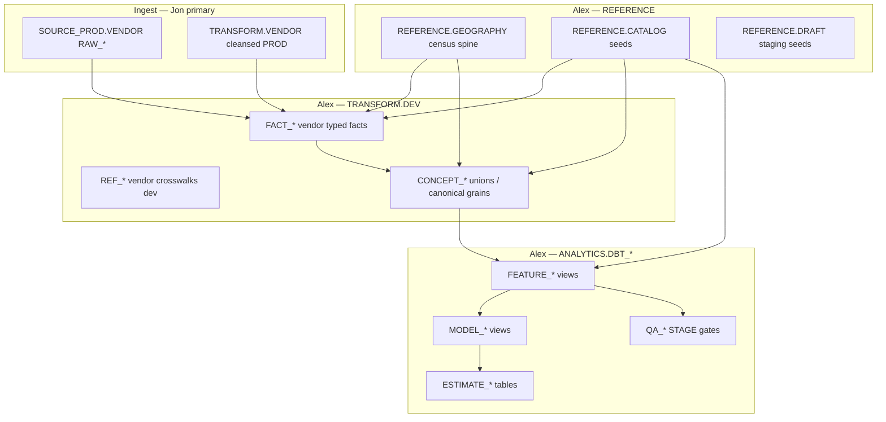

# Architecture overview — semantic layer and warehouse contract

This is a **compressed** view of decisions that are fully specified in [`../rules/ARCHITECTURE_RULES.md`](../rules/ARCHITECTURE_RULES.md) and [`../rules/SCHEMA_RULES.md`](../rules/SCHEMA_RULES.md).

## 1. Layer cake (data flow)

**Reading order for new market metrics:** vendor landing → (optional Jon cleanse) → **`FACT_*`** (grain + `metric_id` / catalog codes) → **`CONCEPT_*`** (cross-vendor union at a declared grain) → **`FEATURE_*`** (analytics read surface, z-scores, cohort logic) → **`MODEL_*`** (composites, rankings) → **`ESTIMATE_*`** (interval / point forecasts when registered).

## 2. Ownership split (one slide version)

| Snowflake area | Primary owner | Surge engineers |
|-----------------|---------------|-----------------|
| **`SOURCE_PROD.[VENDOR].RAW_*`** | Ingest / Jon path | Do not add transform logic; landings only |
| **`TRANSFORM.[VENDOR]`** (PROD vendor silver) | **Jon** | **Read** from dbt here; do not author writes to Jon schemas |
| **`TRANSFORM.DEV`** `FACT_*` / `CONCEPT_*` / `REF_*` | **Alex** (this repo) | Primary implementation surface for migration |
| **`REFERENCE.GEOGRAPHY`** | **Alex** | Census spine, H3 polyfills, non-vendor xwalks only |
| **`REFERENCE.CATALOG` / `REFERENCE.DRAFT`** | **Alex** | Controlled vocabulary + metric registry |
| **`ANALYTICS.DBT_DEV|STAGE|PROD`** | **Alex** | Features, models, estimates, QA gates |
| **`TRANSFORM.FACT`** (future) | **Jon** | Canonical promoted facts; Alex does **not** create this today per architecture rules |

## 3. Why `REFERENCE.CATALOG` sits in the middle

Object names embed **tokens** (`concept_code`, `geo_level_code`, `frequency_code`, …). The catalog is the **compiler symbol table** for the warehouse: if a token is missing or inactive, downstream joins and product contracts drift.

Metric registration gates (null coverage, history, catalog compliance, census join rates) are summarized in [`../rules/ARCHITECTURE_RULES.md`](../rules/ARCHITECTURE_RULES.md) § Metric Registration Gates.

## 4. Geography discipline

- **Vendor-specific** crosswalks (e.g. Zillow metro → CBSA) → **`TRANSFORM.DEV` `REF_*`** until Jon promotes to **`TRANSFORM.[VENDOR]`**.
- **Non-vendor** census spine and admin geography → **`REFERENCE.GEOGRAPHY`** only.

Getting this wrong breaks **metric registration** and **census compliance** tests.

## 5. AI-facing surfaces (conceptual)

- **Today:** LLM and analyst-facing **definitions** and **metric semantics** should be grounded in **`REFERENCE.CATALOG`** rows (especially `metric.definition`, concept packages). See [`REFERENCE_AND_AI.md`](./REFERENCE_AND_AI.md).
- **Target:** **`REFERENCE.AI`** for prompt fragments / lens templates (not fully seeded yet); design in [`../reference/OFFERING_INTELLIGENCE_CANON.md`](../reference/OFFERING_INTELLIGENCE_CANON.md).

## 6. Deep dives (pick by role)

| Role | Next reads |
|------|------------|
| Fact builder | [`../migration/MIGRATION_FACT_SYSTEMIZATION_PLAYBOOK.md`](../migration/MIGRATION_FACT_SYSTEMIZATION_PLAYBOOK.md), vendor `MIGRATION_TASKS_*.md` |
| Analytics | [`../migration/MODEL_FEATURE_ESTIMATION_PLAYBOOK.md`](../migration/MODEL_FEATURE_ESTIMATION_PLAYBOOK.md), [`../migration/PLAYBOOK_ANALYTICS_FEATURES_FROM_CATALOG.md`](../migration/PLAYBOOK_ANALYTICS_FEATURES_FROM_CATALOG.md) |
| Catalog / metrics | [`../migration/MIGRATION_TASKS_VENDOR_METRIC_CATALOG_INTAKE.md`](../migration/MIGRATION_TASKS_VENDOR_METRIC_CATALOG_INTAKE.md), [`../CATALOG_SEED_ORDER.md`](../CATALOG_SEED_ORDER.md) |
