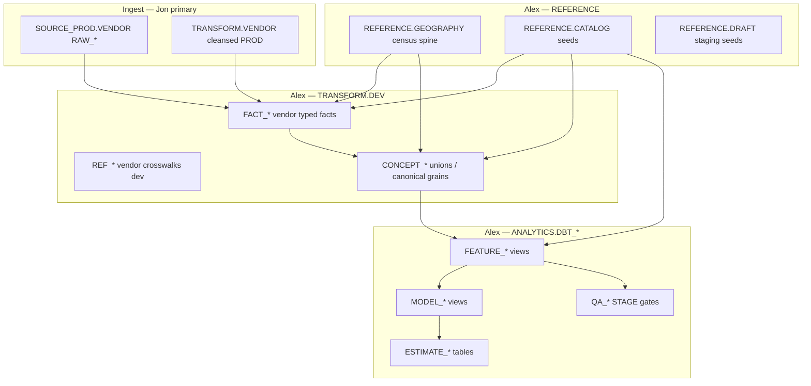

# Semantic layer surge brief

**Repository:** pretiumdata-dbt-semantic-layer  
**Purpose:** One printable document for a data-engineering surge — onboarding, architecture, progress, roadmaps, and reference/AI.  
**Does not replace** canonical rules; it **orients** readers to them.

**PDF:** Export this file from your editor or use Pandoc (example: `pandoc SURGE_BRIEF.md -o SURGE_BRIEF.pdf`). Mermaid diagrams may require a Mermaid-capable pipeline.

---

## Table of contents

1. [Canonical authority (pointers)](#1-canonical-authority-pointers)
2. [Engineer onboarding](#2-engineer-onboarding)
3. [Architecture overview](#3-architecture-overview)
4. [Progress snapshot — April 2026](#4-progress-snapshot--april-2026)
5. [Vendor onboarding + analytic studies roadmap](#5-vendor-onboarding--analytic-studies-roadmap)
6. [Jon — PROD handoff roadmap](#6-jon--prod-handoff-roadmap)
7. [Reference layer and AI](#7-reference-layer-and-ai)

**Name note:** Governing docs use **Jon** for Snowflake **`TRANSFORM.[VENDOR]`** PROD ownership.

---

## 1. Canonical authority (pointers)

| Topic | Path (from repo root) |
|-------|------------------------|
| Operating model (repos, ownership) | `docs/OPERATING_MODEL.md` |
| Architecture (layers, Jon vs Alex, metric gates) | `docs/rules/ARCHITECTURE_RULES.md` |
| Schema matrix (object placement, naming) | `docs/rules/SCHEMA_RULES.md` |
| Migration procedure + legacy DB ban | `docs/migration/MIGRATION_RULES.md` |
| Task register (`T-*`) | `docs/migration/MIGRATION_TASKS.md` |
| Docs index | `docs/README.md` |
| Catalog seed wave order | `docs/CATALOG_SEED_ORDER.md` |

---

## 2. Engineer onboarding

**Goal:** Land in this repo in under a day with the correct **contracts** and **ownership** in mind.

### 2.1 What this repo is

**pretiumdata-dbt-semantic-layer** is the **canonical dbt** home for:

- **`TRANSFORM.DEV`** — typed **`FACT_*`**, **`CONCEPT_*`**, vendor **`REF_*`** (until promoted to Jon’s **`TRANSFORM.[VENDOR]`**).
- **`REFERENCE.CATALOG` / `REFERENCE.DRAFT` / `REFERENCE.GEOGRAPHY`** — governed vocabulary and geography spine (see [§7](#7-reference-layer-and-ai)).
- **`ANALYTICS.DBT_*`** — **`FEATURE_*`**, **`MODEL_*`**, **`ESTIMATE_*`** (and **`QA_*`** on STAGE), **not** facts or concepts.
- **`SERVING.DEMO`** — dev delivery views (thin contract; see `docs/reference/SERVING_DEMO_ICEBERG_TARGETS.md`).

**pretium-ai-dbt** remains a **migration source** (SnowSQL, some ingest, legacy patterns) until retired. Closure for migration work is **here**, not only in the sibling repo — see `docs/migration/CANONICAL_COMPLETION_DEFINITION.md`.

### 2.2 Non-negotiables

1. **Semantics over shortcuts:** governed CSVs (`seeds/reference/catalog/*.csv`) must be **literally correct** (codes, grains, joins), not “close enough.” Repo rule: semantics-over-generic-process.
2. **No legacy PROD DBs in this dbt graph:** no reads of **`TRANSFORM_PROD`**, **`ANALYTICS_PROD`**, **`EDW_PROD`** from `models/` / `macros/` / `tests/` (CI-enforced; see `docs/migration/MIGRATION_RULES.md`).
3. **Prefix placement:** **`FACT_*` / `CONCEPT_*`** only in **`TRANSFORM.DEV`**. **`FEATURE_*` / `MODEL_*` / `ESTIMATE_*`** only in **`ANALYTICS.DBT_*`**. See `docs/rules/ARCHITECTURE_RULES.md`.
4. **Catalog tokens before object names:** every `[concept]`, `[geo_level]`, `[frequency]`, … token in a new object name needs an **active** **`REFERENCE.CATALOG`** row first (`docs/rules/SCHEMA_RULES.md`).

### 2.3 Day-zero setup

From repo root (see also root `README.md`):

```bash
python -m venv .venv && source .venv/bin/activate
pip install dbt-snowflake sqlfluff
dbt deps
```

Profiles: use your org’s Snowflake profile; for CI-style parse-only work, read the comments in **`ci/profiles.yml`** (parse vs `ci` target).

```bash
dbt debug --target dev   # or your Snowflake target
dbt parse
```

Catalog work: follow **`docs/CATALOG_SEED_ORDER.md`** strictly.

### 2.4 Where to work by task type

| You are… | Start in… | Also read… |
|----------|-----------|------------|
| Porting / building vendor facts | `models/transform/dev/{vendor}/` | `docs/migration/MIGRATION_TASKS_*.md` |
| Unifying market signals | `models/transform/dev/concept/` | `docs/migration/MIGRATION_FACT_SYSTEMIZATION_PLAYBOOK.md` |
| Analytics / scores / forecasts | `models/analytics/feature`, `model`, `estimate` | `docs/migration/MODEL_FEATURE_ESTIMATION_PLAYBOOK.md` |
| Registering metrics | `seeds/reference/catalog/metric.csv` | `docs/migration/METRIC_INTAKE_CHECKLIST.md` |
| QA / gates | `models/analytics/qa/`, `tests/` | `docs/migration/QA_GOVERNANCE_TEST_TYPES.md` |

### 2.5 Logging and “done”

- Append batch history and model moves to `docs/migration/MIGRATION_LOG.md` / `docs/migration/MIGRATION_BATCH_INDEX.md` per field guide in the log header.
- Update **`T-*`** rows in `docs/migration/MIGRATION_TASKS.md` when disposition changes.

### 2.6 Who to ask

- **Alex-owned** graph targets and **REFERENCE** seeds: Alex (`docs/rules/ARCHITECTURE_RULES.md`).
- **Vendor PROD cleanse**, **`TRANSFORM.[VENDOR]`**, **`SOURCE_PROD` → `TRANSFORM.[VENDOR]`** pipeline: **Jon** — see [§6](#6-jon--prod-handoff-roadmap).

---

## 3. Architecture overview

Compressed view of `docs/rules/ARCHITECTURE_RULES.md` and `docs/rules/SCHEMA_RULES.md`.

### 3.1 Layer cake (data flow)



**Reading order for new market metrics:** vendor landing → (optional Jon cleanse) → **`FACT_*`** → **`CONCEPT_*`** → **`FEATURE_*`** → **`MODEL_*`** → **`ESTIMATE_*`** (when registered).

### 3.2 Ownership split

| Snowflake area | Primary owner | Surge engineers |
|-----------------|---------------|-----------------|
| **`SOURCE_PROD.[VENDOR].RAW_*`** | Ingest / Jon path | No transform logic in landings |
| **`TRANSFORM.[VENDOR]`** (PROD vendor silver) | **Jon** | **Read** only; no writes to Jon schemas |
| **`TRANSFORM.DEV`** `FACT_*` / `CONCEPT_*` / `REF_*` | **Alex** | Primary migration surface |
| **`REFERENCE.GEOGRAPHY`** | **Alex** | Census spine; no vendor xwalks |
| **`REFERENCE.CATALOG` / `REFERENCE.DRAFT`** | **Alex** | Vocabulary + metric registry |
| **`ANALYTICS.DBT_*`** | **Alex** | Features, models, estimates, QA |
| **`TRANSFORM.FACT`** (future) | **Jon** | Alex does **not** create today |

### 3.3 Why `REFERENCE.CATALOG` sits in the middle

Object names embed **tokens** (`concept_code`, `geo_level_code`, `frequency_code`, …). The catalog is the **compiler symbol table** for the warehouse.

Metric registration gates: see `docs/rules/ARCHITECTURE_RULES.md` (Metric Registration Gates).

### 3.4 Geography discipline

- **Vendor-specific** crosswalks → **`TRANSFORM.DEV` `REF_*`** until Jon promotes to **`TRANSFORM.[VENDOR]`**.
- **Non-vendor** census spine → **`REFERENCE.GEOGRAPHY`** only.

### 3.5 AI-facing surfaces (conceptual)

- **Today:** Ground definitions in **`REFERENCE.CATALOG`** (`metric.definition`, concepts). [§7](#7-reference-layer-and-ai).
- **Target:** **`REFERENCE.AI`** for prompt fragments — design: `docs/reference/OFFERING_INTELLIGENCE_CANON.md`.

### 3.6 Deep dives by role

| Role | Next reads |
|------|------------|
| Fact builder | `docs/migration/MIGRATION_FACT_SYSTEMIZATION_PLAYBOOK.md`, vendor `MIGRATION_TASKS_*.md` |
| Analytics | `docs/migration/MODEL_FEATURE_ESTIMATION_PLAYBOOK.md`, `docs/migration/PLAYBOOK_ANALYTICS_FEATURES_FROM_CATALOG.md` |
| Catalog / metrics | `docs/migration/MIGRATION_TASKS_VENDOR_METRIC_CATALOG_INTAKE.md`, `docs/CATALOG_SEED_ORDER.md` |

---

## 4. Progress snapshot — April 2026

**Scope:** Repo-local file counts. **`T-*`** status: `docs/migration/MIGRATION_TASKS.md` and `docs/migration/MIGRATION_LOG.md`.

### 4.1 Reference catalog (governed seeds)

| Artifact | Location | Approx. rows (excl. header) |
|----------|----------|-----------------------------|
| **Vendors** | `seeds/reference/catalog/vendor.csv` | 53 |
| **Datasets** | `seeds/reference/catalog/dataset.csv` | 89 |
| **Concepts** | `seeds/reference/catalog/concept.csv` | 31 |
| **Metrics** | `seeds/reference/catalog/metric.csv` | ~4,969 |
| **Product type ↔ metric bridge** | `seeds/reference/catalog/bridge_product_type_metric.csv` | ~648 |
| **Derived analytics metrics** | `seeds/reference/catalog/metric_derived.csv` | 7 (active / planned) |

More seeds: `docs/CATALOG_SEED_ORDER.md`.

### 4.2 Transform DEV — facts and concepts

| Pattern | Approx. count | Notes |
|---------|----------------|-------|
| **`FACT_*.sql`** under `models/transform/dev/` | **106** | Government, Zillow research, fund/OpCo, labor risk, corridor, etc. |
| **`CONCEPT_*.sql`** under `models/transform/dev/` | **27** | Market-monthly unions, OpCo progress |

**Migration log:** `MIGRATION_LOG.md` summary shows **57 migrated** / **81** tracked legacy FACT paths, **24 pending** (named lineage in log).

### 4.3 Analytics layer

| Pattern | Approx. count | Notes |
|---------|----------------|-------|
| **`FEATURE_*.sql`** | **10** | |
| **`MODEL_*.sql`** | **4** | |
| **`ESTIMATE_*.sql`** | **0** in `models/analytics/estimate/` | Contract defined; models not shipped yet |
| **`QA_*.sql`** | **25** | |

### 4.4 Portfolio breadth (legacy dataset lens)

`docs/migration/MIGRATION_REGISTRY_VENDORS_DATASETS_METRICS.md` §3: **pretium-ai-dbt** `dim_dataset_config.csv` — **147 datasets** / **63 vendor IDs**. This repo’s `dataset.csv` is the **governed** subset.

### 4.5 Next milestones

1. Close **`T-VENDOR-*-READY`** tasks with smoke SQL + catalog rows.
2. **`T-CATALOG-METRIC-VENDOR-ROLLOUT`** (`in_progress`) — grow `metric.csv` with architecture gates.
3. First **`ESTIMATE_*`** under `models/analytics/estimate/` when `metric_derived` promotes — `docs/migration/MODEL_FEATURE_ESTIMATION_PLAYBOOK.md`.

---

## 5. Vendor onboarding + analytic studies roadmap

### 5.1 Vendor onboarding

**Status:** `docs/migration/MIGRATION_TASKS.md`  
**Registry:** `docs/migration/MIGRATION_REGISTRY_VENDORS_DATASETS_METRICS.md` §2.

| Theme | Representative tasks | Checklist |
|-------|------------------------|-----------|
| ApartmentIQ + Yardi Matrix | `T-VENDOR-APARTMENTIQ-READY`, `T-VENDOR-YARDI-MATRIX-READY` | `docs/migration/MIGRATION_TASKS_APARTMENTIQ_YARDI_MATRIX.md` |
| Yardi operational (BH / Progress) | `T-VENDOR-YARDI-READY` | `docs/migration/MIGRATION_TASKS_YARDI_BH_PROGRESS.md` |
| First Street + RCA / MSCI | `T-VENDOR-FIRST-STREET-READY`, `T-VENDOR-RCA-READY` | `docs/migration/MIGRATION_TASKS_FIRST_STREET_RCA.md` |
| CoStar | `T-VENDOR-COSTAR-READY` | `docs/migration/MIGRATION_TASKS_COSTAR.md` |
| Cherre | `T-VENDOR-CHERRE-READY` | `docs/migration/MIGRATION_TASKS_CHERRE.md` |
| Redfin + Stanford SEDA | `T-VENDOR-REDFIN-READY`, `T-VENDOR-STANFORD-READY` | `docs/migration/MIGRATION_TASKS_STANFORD_REDFIN.md` |
| BPS / Census / BLS / LODES | `T-TRANSFORM-*` | `docs/migration/MIGRATION_TASKS_TRANSFORM_BPS_CENSUS_BLS_LODES.md` |
| Corridor pipeline | `T-CORRIDOR-*` | `docs/migration/MIGRATION_TASKS_CORRIDOR_PIPELINE_SOURCES.md` |
| Cybersyn | `T-CYBERSYN-*` | `docs/migration/MIGRATION_TASKS_CYBERSYN_SOURCE_SNOW.md`, `docs/reference/CYBERSYN_GLOBAL_GOVERNMENT_BRING_IN_MATRIX.md` |
| Zillow | `T-*` in doc | `docs/migration/MIGRATION_TASKS_ZILLOW_TRANSFORM_DEV.md` |

**Bulk path:** ~**2,129** pretium-ai-dbt model paths (`MIGRATION_TASKS_INVENTORY_models.txt`); fact gap waves: `docs/migration/MIGRATION_FACT_GAP_WAVE_QUEUE.md`.

**Vendor context:** `docs/vendor/vendors.md`, `docs/vendor/0_inventory/`.

### 5.2 Planned studies (validation / governance)

Maps to **GOV_*** taxonomy: `docs/migration/QA_GOVERNANCE_TEST_TYPES.md`.

**Catalog / metrics:** `docs/migration/QA_METRIC_LAYER_VALIDATION.md`, `docs/migration/QA_TRANSFORM_DEV_CATALOG_REGISTRATIONS.md`, `docs/migration/METRIC_INTAKE_CHECKLIST.md`.

**QA model themes** (`models/analytics/qa/`): concept–feature parity (`qa_feature_concept_parity_diff.sql`, `qa_feature_concept_alignment.sql`); collinearity / series collision; geography sensitivity / cold start; distribution shift / structural breaks; vendor blend ablation (`qa_vendor_blend_ablation_rent.sql`).

**Cross-cutting:** `docs/migration/VENDOR_CONCEPT_COVERAGE_MATRIX.md`, `docs/migration/MIGRATION_TASKS_SOURCES_GAP_ANALYSIS.md`, `docs/migration/MIGRATION_TASKS_POLARIS_DATASET_PRIORITIES.md`, `docs/migration/MIGRATION_TASKS_STRATA_BACKEND_LINEAGE.md`, `docs/migration/MIGRATION_TASKS_TEARSHEET_SERVICE.md`.

**Example end-to-end slice:** `docs/migration/LABOR_AUTOMATION_RISK_STACK_SEMANTIC_LAYER.md`, `docs/runbooks/RUN_LABOR_AUTOMATION_RISK_STACK_DBT.md`.

### 5.3 How to use during the surge

1. Pick vendor cluster → `MIGRATION_TASKS_*.md` → inventory SQL → `MIGRATION_LOG.md` on exit.  
2. Pair each FACT wave with a **GOV_*** study.  
3. Do not mark **`T-*`** `migrated` without catalog alignment when metrics matter — **`T-CATALOG-METRIC-VENDOR-ROLLOUT`**.

---

## 6. Jon — PROD handoff roadmap

**Audience:** **Jon** — **`TRANSFORM.[VENDOR]`** and **`SOURCE_PROD` → vendor silver** (`docs/rules/ARCHITECTURE_RULES.md`, `docs/OPERATING_MODEL.md`).

**Alex:** **`TRANSFORM.DEV`**, **`REFERENCE.*`**, **`ANALYTICS.DBT_*`** — **read** Jon PROD; **no** dbt writes to **`TRANSFORM.[VENDOR]`**.

Many **`FACT_*`** models read **`SOURCE_PROD` `RAW_*`** until **`TRANSFORM.[VENDOR]`** exists; **end state** is **`ref()` / `source()`** to Jon-cleansed tables. Vendor **crosswalks** move from Alex **`REF_*`** to **`TRANSFORM.[VENDOR]`** when promoted.

### 6.1 Promotion sequence

| Step | Jon action | Unblocks |
|------|------------|----------|
| **J0** | **`SOURCE_PROD` `RAW_*`** contracts stable | Alex `source()` compiles |
| **J1** | Cleanse silver in **`TRANSFORM.[VENDOR]`** | Alex re-points **`FACT_*`** off RAW-only |
| **J2** | Vendor xwalks in **`TRANSFORM.[VENDOR]`** | Metric geo compliance |
| **J3** | Grants, PKs, cadence, breaking-change policy | QA, serving |
| **J4** | Optional future **`TRANSFORM.FACT`** | Long-term canonical facts (Jon-owned; not Alex-created today) |

### 6.2 Vendor clusters (typical PROD dependency)

Live list: **`MIGRATION_TASKS.md`**. Examples: ApartmentIQ, Yardi Matrix, Yardi BH/Progress, CoStar, Cherre, First Street, RCA/MSCI, Redfin, Stanford; government feeds often **`TRANSFORM.BLS` / `CENSUS` / `LODES` / `BPS`**.

### 6.3 Geography boundary

Vendor geo normalization → **`TRANSFORM.[VENDOR]`** or temp **`TRANSFORM.DEV` `REF_*`**. Do not duplicate **`REFERENCE.GEOGRAPHY`** in vendor schemas without coordination.

### 6.4 Communication protocol

1. Breaking table renames: old/new FQN before cutover.  
2. After Jon promotes silver: Alex PR to switch reads + `MIGRATION_LOG.md`.  
3. **`metric.table_path`** stable before metric registration finalizes.

### 6.5 Jon-facing artifacts

`docs/migration/artifacts/batch012_yardi/`, `docs/migration/MIGRATION_BASELINE_RAW_TRANSFORM.md`, `docs/rules/TRANSFORM_VENDOR_DESIGN_PRINCIPLES.md`.

---

## 7. Reference layer and AI

### 7.1 Two meanings of “reference”

| Meaning | Where | What |
|---------|-------|------|
| **A)** Repo **`seeds/reference/`** | Git CSV + YAML | **Authoring** → becomes Snowflake **`REFERENCE.*`** via `dbt seed` / build. |
| **B)** Snowflake **`REFERENCE.CATALOG`**, **`REFERENCE.GEOGRAPHY`**, **`REFERENCE.DRAFT`**, (future) **`REFERENCE.AI`** | Snowflake | **Runtime** registry for dbt, QA, apps, prompts. |

### 7.2 `seeds/reference/catalog/` → `REFERENCE.CATALOG`

Controlled vocabulary and semantic registry: **`concept.csv`**, **`vendor.csv`**, **`dataset.csv`**, **`metric.csv`** (canonical metric SoT), dimension seeds (`geo_level`, `frequency`, `model_type`, `estimate_type`, …), bridges (**`bridge_product_type_metric.csv`**), **`metric_derived`**, **`metric_derived_input`**, **`catalog_wishlist.csv`**. Load order: **`docs/CATALOG_SEED_ORDER.md`**.

### 7.3 `seeds/reference/draft/` → `REFERENCE.DRAFT`

In-progress rows not yet promoted to catalog.

### 7.4 Geography → `REFERENCE.GEOGRAPHY`

`models/reference/geography/` — census spine, H3, ZIP–county–CBSA; **no vendor-specific** xwalks.

### 7.5 Uses in the stack

Governance tests; naming tokens before new objects; authoritative definitions for humans and tools; **`QA_*`** vs catalog expectations.

### 7.6 AI (practical)

- **Today:** RAG / agents use **`REFERENCE.CATALOG.metric`** (`definition`, grains, `table_path`) plus concept / dataset / vendor rows as **ground truth**. Align **`FEATURE_*` / `MODEL_*`** with **`metric_derived`** when active (`docs/reference/CATALOG_METRIC_DERIVED_LAYOUT.md`).
- **Target:** **`REFERENCE.AI`** for governed prompt/lens text — `docs/reference/OFFERING_INTELLIGENCE_CANON.md`; `seeds/reference/ai/` not fully present yet.
- **Avoid** legacy FQNs in new prompts (`EDW_PROD`, retired catalog paths).

**One line:** **`REFERENCE.CATALOG`** is the dictionary and symbol table; **`REFERENCE.GEOGRAPHY`** is the shared map; **AI** should read them before inventing metric meaning; **`REFERENCE.AI`** will hold governed narrative lenses on top.

---

*End of surge brief. Split chapters for editing: `docs/surge/ENGINEER_ONBOARDING.md`, `ARCHITECTURE_OVERVIEW.md`, `PROGRESS_SNAPSHOT_2026-04.md`, `VENDOR_AND_ANALYTIC_STUDIES_ROADMAP.md`, `JON_PROD_HANDOFF_ROADMAP.md`, `REFERENCE_AND_AI.md`.*
